# Robustness of Vision Algorithms Under Real-World Image Distortions

**Course project — Digital Image Processing & Computer Vision (classical + deep learning)**

## Abstract

This project evaluates how three computer vision tasks — two classical algorithms and
one deep-learning model — degrade under three realistic image distortions (JPEG
compression, low-light, motion blur), whether classical restoration can recover lost
performance, and whether fine-tuning a detector on distorted data helps. Evaluation
runs on a 150-image subset of BDD100K (real driving footage) across five calibrated
severity levels per distortion, with object detection scored against real
ground-truth bounding boxes and the two classical tasks scored against their own
clean-image baseline. Motion-blur restoration is further broken out into an explicit
three-method comparison (two Wiener-deconvolution variants and Richardson-Lucy),
because no single image-quality metric agreed with the others on which method actually
helped the downstream task — a result treated as a finding in its own right rather
than smoothed over. All numbers in this document come from real runs on real data; none
are simulated or illustrative placeholders.

---

## Table of Contents

1. [Introduction](#1-introduction)
2. [Environment and Setup](#2-environment-and-setup)
3. [Usage](#3-usage)
4. [Repository Structure](#4-repository-structure)
5. [Dataset](#5-dataset)
6. [Methodology](#6-methodology)
   - [6.1 Pipeline Architecture](#61-pipeline-architecture)
   - [6.2 Tasks](#62-tasks)
   - [6.3 Distortions](#63-distortions)
   - [6.4 Restoration Methods](#64-restoration-methods)
   - [6.5 Restoration Method Comparison (Motion Blur)](#65-restoration-method-comparison-motion-blur)
   - [6.6 Fine-Tuning](#66-fine-tuning)
7. [Results](#7-results)
   - [7.1 Summary Table](#71-summary-table)
   - [7.2 Robustness Curves](#72-robustness-curves)
   - [7.3 Key Findings](#73-key-findings)
   - [7.4 Fine-Tuning Results](#74-fine-tuning-results)
8. [Limitations](#8-limitations)


---

## 1. Introduction

Vision systems deployed in the real world rarely see the clean, well-lit images they
were trained on. This project asks a concrete question: **for a small set of common
vision tasks, how much does performance actually degrade under realistic distortions,
can standard classical restoration techniques recover any of it, and does fine-tuning
help?** Rather than assume the answers, everything here is measured directly.

**Project summary:**

| # | Aspect | Choice | Rationale |
|---|--------|--------|-----------|
| 1 | Dataset | [BDD100K](https://doc.bdd100k.com/), 150-image subset (`train` split) | Real driving footage with genuine detection ground truth; see [§5](#5-dataset) |
| 2 | Tasks | Edge/Corner detection, Line detection, Object detection | 2 low-level (classical) + 1 high-level (DL); see [§6.2](#62-tasks) |
| 3 | Methods | Canny + Shi-Tomasi/ORB, Canny + Hough Transform, YOLOv8n | Existing, standard library implementations only |
| 4 | Distortions | JPEG compression, low-light, motion blur | Directly relevant to dashcam/driving conditions; see [§6.3](#63-distortions) |
| 5 | Severity | 5 calibrated levels per distortion, measured in PSNR (dB) | See [§6.3](#63-distortions) |
| 6 | Restoration | Bilateral deblocking, Gamma+CLAHE, Wiener deconvolution (tuned) | See [§6.4](#64-restoration-methods)–[§6.5](#65-restoration-method-comparison-motion-blur) |
| 7 | Fine-tuning | YOLOv8n only | The classical tasks have no trainable weights; see [§6.6](#66-fine-tuning) |

---

## 2. Environment and Setup

This section covers everything needed to get the code running on a fresh machine.
Read this before anything else if you're cloning this repository for the first time.


### 2.1 Installation

```bash
git clone <your-repo-url>
cd <repo-folder>

python -m venv .venv

# activate the virtual environment:
#   Windows, Git Bash:        source .venv/Scripts/activate
#   Windows, PowerShell/cmd:  .venv\Scripts\activate
#   macOS / Linux:             source .venv/bin/activate

pip install -r requirements.txt
```

Then, before running anything else, verify the environment resolves correctly:

```bash
cd src
python config.py
```

This prints every key path the project uses (`PROJECT_ROOT`, `IMAGES_DIR`,
`LABELS_PATH`, `BASELINE_WEIGHTS`, `TABLES_DIR`, `FIGURES_DIR`) along with whether each
one actually exists on disk. All paths are resolved **relative to the repository's own
location** (`src/config.py`, via `Path(__file__)`) — never hardcoded to any specific
machine or username. If everything shows `exists: True`, you're ready to run anything
in [§3](#3-usage). If something shows `exists: False`, the clone/extraction likely
didn't bring over the `data/`, `models/`, or `results/` folders intact — check against
the structure in [§4](#4-repository-structure).


---

## 3. Usage

All commands below assume an activated virtual environment and `cd src` (i.e. run from
inside the repository's `src/` folder), unless otherwise noted.

### 3.1 Full pipeline (all 3 tasks × all distortions × clean/distorted/restored)

```bash
python run_full.py --batch_limit 150
```

Processes all 150 images through every stage and writes
`results/tables/full_results.csv`. This is **resumable** — it checks the output CSV for
already-processed images and skips them — so it's safe to run in smaller batches
(e.g. `--batch_limit 20`, repeated) if you'd rather not commit to one long run.

### 3.2 Fine-tuning (Stage 4)

```bash
python finetune_run_v2.py        # trains + copies weights to models/yolov8n_finetuned.pt
python finetune_eval_fixed.py    # evaluates baseline vs. fine-tuned on the held-out set
```

### 3.3 Motion-blur restoration method comparison (§6.5)

```bash
python compare_motion_blur_methods.py --batch_limit 150   # resumable, same pattern as run_full.py
python make_comparison_figures.py
```

### 3.4 Regenerate figures

```bash
python make_figures.py
python make_slide_figures.py
```

### 3.5 Regenerate the presentation

```bash
cd ../presentations
python build_deck.py
```

Pure Python (`python-pptx`) — no Node.js/npm needed.

---

## 4. Repository Structure

```
├── README.md                      <- this file
├── requirements.txt
├── src/                            <- all pipeline code
│   ├── config.py                    <- all paths, resolved relative to the repo (see §9)
│   ├── distortions.py               <- 3 distortions x 5 severity levels
│   ├── restoration.py               <- classical restoration per distortion (3 motion-blur variants kept side by side)
│   ├── metrics.py                   <- PSNR/SNR, detection P/R/F1, edge/line IoU, stripe/artifact score
│   ├── task_edge_corner.py          <- Task 1 (low-level, classical)
│   ├── task_lines.py                <- Task 2 (low-level, classical)
│   ├── task_detection.py            <- Task 3 (high-level, DL) + BDD100K GT loader
│   ├── pipeline.py                  <- orchestrates all 3 tasks x all distortions x all stages
│   ├── run_full.py                  <- resumable batch runner (used to process all 150 images)
│   ├── recompute_motion_blur_restore.py <- targeted recompute after restoration.py changes
│   ├── compare_motion_blur_methods.py   <- §6.5 ablation study across all 3 restoration methods
│   ├── finetune_utils.py            <- BDD100K GT -> YOLO label format conversion
│   ├── finetune_run.py              <- Stage 4, attempt 1 (see §9)
│   ├── finetune_run_v2.py           <- Stage 4, attempt 2 (frozen backbone, no mosaic) — production
│   ├── finetune_eval_fixed.py       <- corrected baseline-vs-finetuned evaluation
│   ├── make_figures.py              <- generates the main report figures
│   ├── make_slide_figures.py        <- slide-optimized versions of the key charts
│   └── make_comparison_figures.py   <- §6.5 ablation study figures
├── data/
│   └── raw/bdd_subset/
│       ├── images/                  <- 150 BDD100K images
│       └── labels_subset.json       <- matching detection GT (filtered from the ~1GB full file)
├── models/
│   ├── yolov8n.pt                   <- pretrained COCO weights (baseline)
│   └── yolov8n_finetuned.pt         <- fine-tuned on distorted images (Stage 4)
├── results/
│   ├── tables/                      <- all raw + summary CSVs
│   └── figures/                     <- all plots (referenced throughout this README)
├── presentations/
│   └── vision_robustness_presentation.pptx
└── docs/
    └── (this README is the primary report)
```

---

## 5. Dataset

This project uses a **150-image subset of BDD100K** (`train` split), with matching
detection labels.


- **BDD100K**: also login-gated for bulk download, but a subset downloaded locally is
  trivial to filter and hand off — see [§9](#9-development-log) for exactly how this
  was done, including filtering a ~1 GB label file down to what was actually needed.

**GT sanity check.** Before trusting the label file, its boxes were rendered onto a
sample image to visually confirm the coordinates line up correctly:

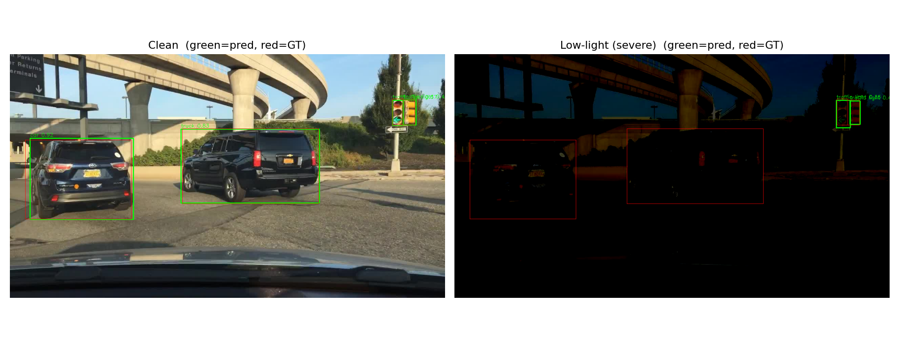
*Green = model prediction, red = ground truth; clean image (left) vs. the same image
under severe low-light distortion (right).*

**Class distribution** in this 150-image subset (after mapping BDD100K's 10 classes
onto COCO's 80 — see [§6.2](#62-tasks)):

| Class | Instances |
|---|---|
| car | 1543 |
| traffic light | 400 |
| truck | 83 |
| bus | 43 |
| person | 13 |

The imbalance (dominated by cars/traffic lights; zero bicycle/motorcycle/train
instances) is a known limitation of a 150-image sample — i could have seen it coming and choose random images until better split, but it is not the highlight of the project so i just continued

---

## 6. Methodology

### 6.1 Pipeline architecture

Every image passes through the same four stages, evaluated on all 3 tasks:

```
CLEAN IMAGE
    │
    ├── Stage 1: baseline (clean) evaluation
    │
    ├── Stage 2: apply distortion (3 types x 5 severity levels) → evaluate
    │
    ├── Stage 3: apply classical restoration to the distorted image → evaluate
    │
    └── Stage 4: (object detection only) fine-tune YOLOv8n on distorted images,
                  re-evaluate on a held-out distorted set
```

150 images × (1 clean + 3 distortions × 5 levels × 2 stages [distorted, restored])
→ **4,650 result rows** in `results/tables/full_results.csv`.

### 6.2 Tasks

**Edge/Corner detection** (low-level, classical) — `cv2.Canny` for edges,
`cv2.goodFeaturesToTrack` (Shi-Tomasi) + `cv2.ORB_create` for corners/keypoints. No
ground truth exists for "correct" edges/corners, so robustness is measured against the
**clean image's own output** as a reference:
- Edge IoU: rasterized Canny edge maps, dilated slightly, IoU against the clean edge map
- Corner count ratio: `#corners(distorted) / #corners(clean)`
- ORB match ratio: fraction of clean keypoints with a good descriptor match in the distorted image

**Line detection** (low-level, classical) — `cv2.Canny` → `cv2.HoughLinesP`
(probabilistic Hough transform), aimed at lane/road structure. This replaced an
originally-planned optical-flow/tracking task, dropped because it required consecutive
video frames that weren't available (see [§9](#9-development-log)). Same
vs.-clean-reference philosophy: line-count ratio + rasterized line-mask IoU.

**Object detection** (high-level, deep learning) — `ultralytics.YOLO("yolov8n.pt")`,
COCO-pretrained, unmodified except in Stage 4. This is the one task with **real ground
truth**, scored with IoU-matched precision/recall/F1 against BDD100K's actual bounding
boxes rather than a self-referential proxy.

BDD100K's 10 detection classes don't exactly match COCO's 80, so the overlapping ones
are mapped and the rest dropped:

| BDD100K class | → COCO class |
|---|---|
| pedestrian, rider | person |
| car | car |
| truck | truck |
| bus | bus |
| train | train |
| motorcycle | motorcycle |
| bicycle | bicycle |
| traffic light | traffic light |
| traffic sign | *(dropped — no COCO equivalent)* |

### 6.3 Distortions

All three are directly relevant to driving/dashcam footage. Each has 5 fixed severity
levels (parameter values chosen for a good spread in signal quality, not per-image
calibrated):

| Distortion | Library call | Severity levels (param) | Resulting PSNR range (this dataset) |
|---|---|---|---|
| Compression | `cv2.imencode('.jpg', ..., IMWRITE_JPEG_QUALITY)` | quality = 50, 30, 15, 8, 3 | ~39 → ~24 dB |
| Low-light | `albumentations.RandomBrightnessContrast` | brightness = -0.2 … -0.9 | ~18 → ~7 dB |
| Motion blur | custom linear kernel + `cv2.filter2D` | kernel length = 5, 9, 15, 21, 31 px | ~33 → ~25 dB |

Motion blur uses a **known, controlled linear kernel** (not a black-box random blur),
so restoration can be genuine non-blind deconvolution rather than blind guesswork.

Image quality is measured as PSNR (dB) between clean and distorted images — the same
`10·log10(P_signal/P_noise)` "SNR" formula referenced in the course material,
generalized here from the pure-additive-noise case to any pixel-domain distortion.

**Visual example** (most severe level of each distortion, plus restoration):

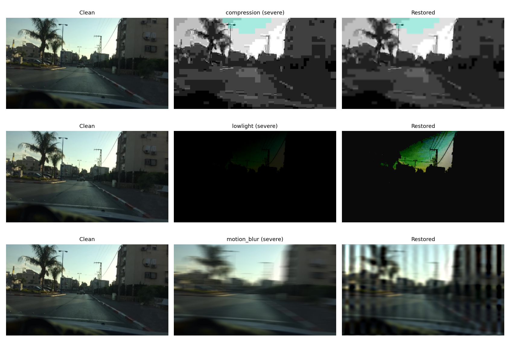

### 6.4 Restoration methods

| Distortion | Method | Why |
|---|---|---|
| Compression | Bilateral filter on the Y (luma) channel only | Smooths blocking artifacts while preserving color and most edges |
| Low-light | Gamma correction (γ=0.35) + CLAHE on the L channel | Lifts shadow detail, then boosts local contrast without blowing out highlights |
| Motion blur | Wiener deconvolution, known kernel, regularization tuned per severity level | Best detection F1 of three methods explicitly compared — see §6.5 |

**Task overlay example** (edges/corners and lines, clean vs. severely motion-blurred):

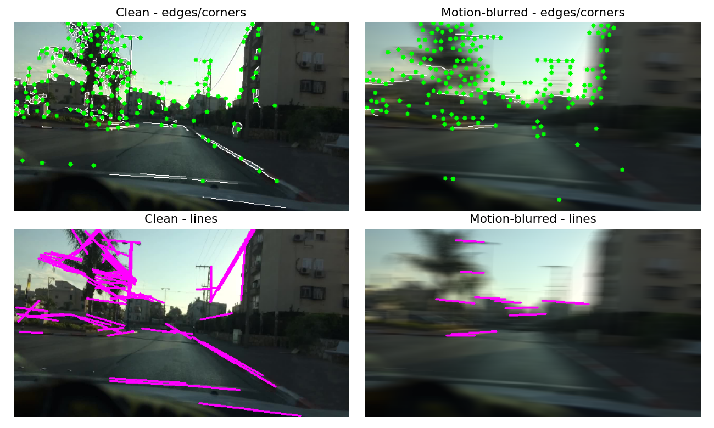

### 6.5 Restoration method comparison (motion blur)

Motion-blur restoration is the one place in this project where the "obvious" choice
changed more than once. Rather than only report the final answer, all three attempts
are kept side by side in `restoration.py` (`MOTION_BLUR_METHODS`) and compared
explicitly across all 150 images and all 5 severity levels
(`results/tables/motion_blur_method_comparison.csv`).

**Why Wiener deconvolution gets worse as the blur kernel gets longer.** Wiener
deconvolution divides in the frequency domain by the blur kernel's frequency response
(regularized by a `balance` parameter to avoid dividing by ~0). A linear motion-blur
kernel of length *L* has a sinc-shaped frequency response with *zeros* spaced roughly
*1/L* apart — the longer the kernel, the more zeros, more densely packed. Near each
zero, the unregularized inverse blows up, amplifying whatever noise/quantization exists
at that frequency; for a horizontal kernel this amplification shows up as periodic
*vertical* stripes in the spatial domain. A single `balance` value is one global
trade-off between "suppress noise near the zeros" and "actually deblur" — for a long
kernel with many closely-spaced zeros, no single value works well everywhere.

**The three methods compared:**

| Method | Description |
|---|---|
| `wiener_fixed` | Wiener deconvolution, single fixed `balance=0.02` (the initial, naive attempt) |
| `wiener_tuned` | Wiener deconvolution, `balance` scaled up for longer kernels via a hand-tuned lookup table |
| `richardson_lucy` | Richardson-Lucy deconvolution, fixed at 3 iterations (iteration count is itself the regularization — early stopping) |

**Aggregate results (all 150 images, all 5 severity levels):**

| Method | PSNR (dB) | Stripe score (artifact, lower=cleaner) | Edge IoU | Line IoU | Detection F1 |
|---|---|---|---|---|---|
| *(distorted, no restoration)* | 27.66 | 0.54 | 0.443 | 0.356 | 0.323 |
| `wiener_fixed` | 25.70 | 2.78 | **0.625** | **0.494** | 0.311 |
| `wiener_tuned` | **28.31** | 1.49 | 0.513 | 0.399 | **0.357** |
| `richardson_lucy` | 27.58 | 2.04 | 0.479 | 0.371 | 0.291 |

No method wins on every metric — that disagreement *is* the finding. `wiener_fixed` has
the best structural recovery (edge/line IoU) on average, `wiener_tuned` has the best
PSNR and by far the best detection F1, and `richardson_lucy` isn't actually the best on
anything in aggregate despite being the simplest to configure (one iteration count, no
per-level lookup table).

**Where it really falls apart — per severity level:**

| Level (kernel) | Method | PSNR | Stripe score | Detection F1 |
|---|---|---|---|---|
| 4 (31px, most severe) | distorted | 24.17 | 0.34 | 0.172 |
| 4 | `wiener_fixed` | **16.53** | **4.23** | **0.017** |
| 4 | `wiener_tuned` | 23.33 | 1.36 | 0.199 |
| 4 | `richardson_lucy` | 23.97 | 1.32 | 0.104 |

At the most severe level, `wiener_fixed` doesn't just underperform — it nearly destroys
detection entirely (F1 0.017), exactly as the frequency-domain explanation above
predicts: the longest kernel has the most tightly packed frequency-response zeros, and
a regularization value tuned for short kernels is far too weak there. Both
`wiener_tuned` and `richardson_lucy` avoid that collapse, but `richardson_lucy` —
despite better stripe/PSNR numbers — still ends up with *worse* detection F1 than
`wiener_tuned` at this level (0.104 vs. 0.199), and worse than doing nothing at all
(0.172).

**Visual comparison** (clean / distorted / all three restorations, at increasing severity):

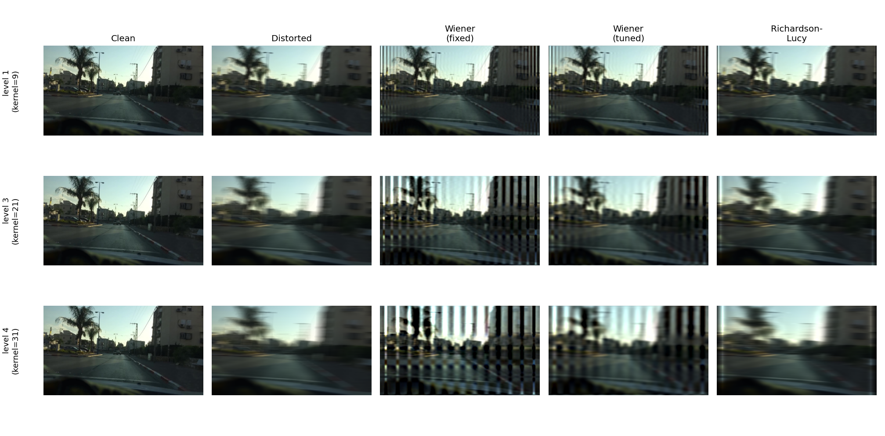

**Metric trends across severity, all methods overlaid:**

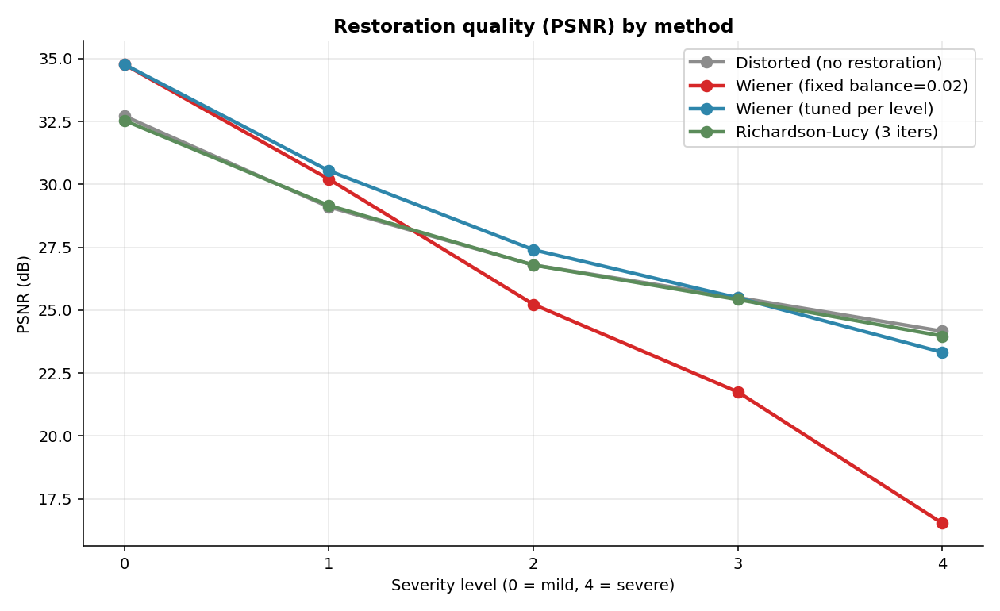
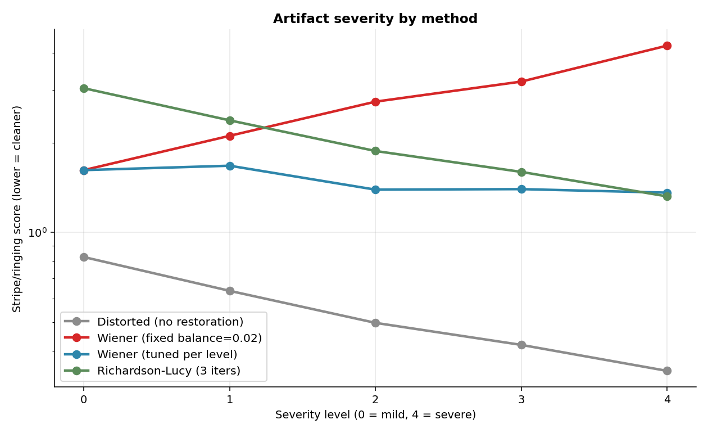
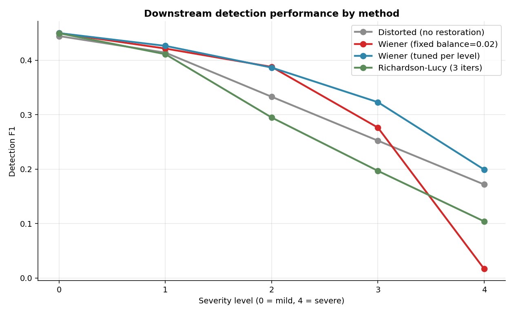

**Takeaway.** `wiener_tuned` is used as the production restoration method for this
project's headline results ([§7](#7-results)) because it has the best detection F1 —
the metric with real ground truth, and therefore the one trusted most here. But it
required the most manual tuning (a per-severity-level lookup table), and the
convenience of "just tune the regularization" only goes so far, as `wiener_fixed`'s
collapse at the most severe level shows. `richardson_lucy` is simpler to configure and
looks cleanest to a human eye or a generic image-quality metric, and would be the
reasonable choice if this were purely an image-quality task — it just isn't the best
choice for *this* task. Which restoration method is "best" depends entirely on what is
being optimized for.

### 6.6 Fine-tuning

Stage 4 fine-tunes `yolov8n.pt` on a small set of distorted images and re-evaluates on
a held-out distorted set never seen during training — object detection is the only
task fine-tuned, since edge/corner and line detection are classical algorithms with no
trainable weights. Two attempts were made (see [§9](#9-development-log) for the full
story); the second (`finetune_run_v2.py`) is the production version, using a frozen
backbone (`freeze=10`) and disabled mosaic augmentation, both standard small-data
fine-tuning practices. Training runs entirely on CPU (`device="cpu"`), 8 epochs, and
completes in well under 5 minutes. Results are in [§7.4](#74-fine-tuning-results).

---

## 7. Results

### 7.1 Summary table

Averaged across all 150 images and all 5 severity levels:

| Distortion | Stage | SNR (dB) | Edge IoU | Line IoU | Det. Precision | Det. Recall | Det. F1 |
|---|---|---|---|---|---|---|---|
| — | clean | ∞ | 1.000 | 1.000 | 0.691 | 0.369 | **0.450** |
| compression | distorted | 31.8 | 0.792 | 0.651 | 0.560 | 0.265 | 0.335 |
| compression | restored | 30.0 | 0.601 | 0.461 | 0.603 | 0.290 | **0.367** |
| lowlight | distorted | 9.4 | 0.364 | 0.284 | 0.341 | 0.124 | **0.166** |
| lowlight | restored | 12.2 | 0.354 | 0.298 | 0.314 | 0.116 | 0.154 |
| motion_blur | distorted | 27.7 | 0.443 | 0.356 | 0.648 | 0.241 | 0.323 |
| motion_blur | restored | 28.3 | 0.513 | 0.399 | 0.639 | 0.275 | **0.357** |

Full per-image, per-level data: `results/tables/full_results.csv` (4,650 rows).

### 7.2 Robustness curves

Metric vs. SNR, distorted vs. restored:

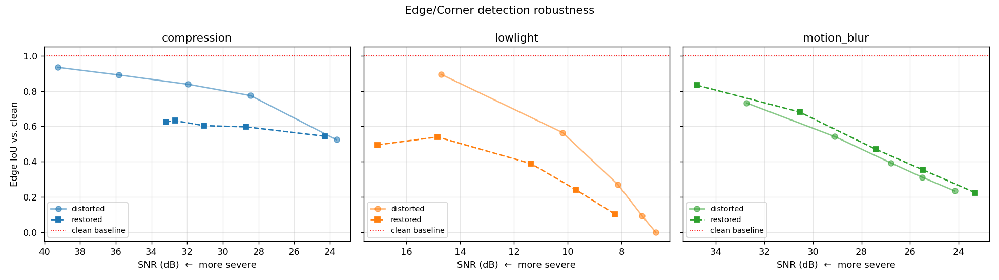
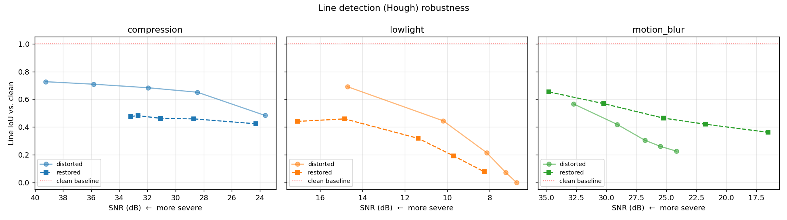
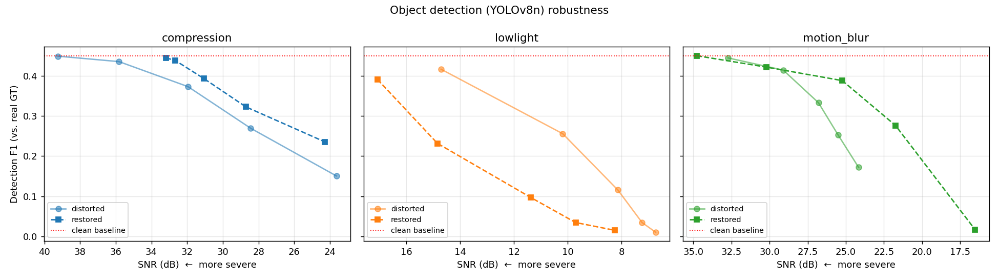

### 7.3 Key findings

1. **Clear degradation with severity.** All three tasks degrade monotonically as SNR
   drops — e.g. compression detection F1 falls from 0.449 (mild, 39 dB) to 0.151
   (severe, 24 dB).

2. **Restoration helps most exactly when things are worst.** For compression, deblocking
   barely changes F1 at mild severity (0.449→0.444) but meaningfully helps at severe
   levels (0.151→0.235). There's little to fix when damage is minor.

3. **Pixel-quality metrics and downstream task performance don't always agree.**
   Low-light restoration *improves* SNR (9.4→12.2 dB) but *slightly hurts* detection F1
   (0.166→0.154). CLAHE+gamma brightens the image for human viewing but can amplify
   noise/color artifacts in ways that confuse the detector — a genuine, non-obvious
   result, not a bug.

4. **The "cleanest-looking" restoration isn't always the best one.** Full breakdown in
   [§6.5](#65-restoration-method-comparison-motion-blur): Richardson-Lucy looks
   cleanest and has the best PSNR/stripe scores in several conditions, but has the
   **worst detection F1 of the three methods compared** (0.291, below even doing
   nothing at 0.323). No single quality metric reliably predicted which restoration
   method would actually help the downstream task.

5. **Baseline domain gap.** Even on *clean* images, stock COCO-pretrained YOLOv8n only
   reaches F1=0.45 against BDD100K's real GT — expected, since BDD100K's camera
   angle/height and object scale differ from COCO's training distribution. This
   motivates fine-tuning ([§7.4](#74-fine-tuning-results)).

### 7.4 Fine-tuning results

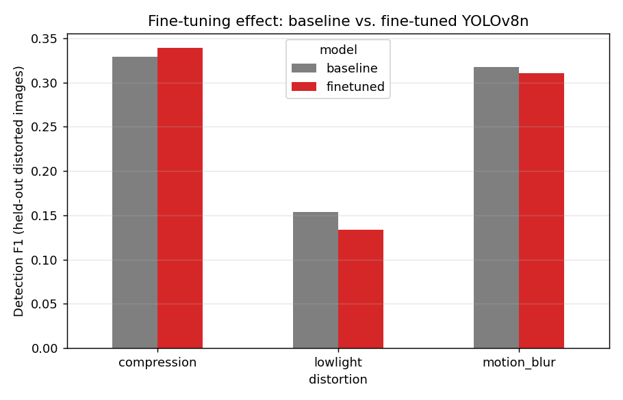

| | Precision | Recall | F1 |
|---|---|---|---|
| Baseline (pretrained) | 0.515 | 0.201 | **0.267** |
| Fine-tuned | 0.443 | 0.214 | 0.261 |

**Honest result: fine-tuning did not clearly help.** Overall F1 is essentially flat
(0.267 → 0.261), with a small recall gain traded for a precision drop. Per distortion,
results are mixed: compression improved slightly (0.329→0.339), low-light got worse
(0.154→0.134), motion blur stayed about flat (0.317→0.311).

This is reported as a legitimate finding, not a failure to hide. The fine-tuning set is
small (40–50 training images, 5–8 epochs, CPU-only) — matching this course's explicit
"small scale" allowance — which is squarely the regime where catastrophic forgetting
can outweigh adaptation benefits. Plausible next steps (not attempted here, by choice):
more training images, more epochs, or a manually-tuned rather than auto-selected
learning rate.

---

## 8. Limitations

- **Small scale by design.** 150 images total (100 held-out for baseline evaluation +
  50 for fine-tuning) is small by deep learning standards. This is a deliberate,
  explicitly-permitted choice for this course project — the pipeline itself scales to
  any number of images by construction.
- **Class imbalance.** This 150-image sample has zero bicycle/motorcycle/train
  instances and is dominated by cars and traffic lights (see [§5](#5-dataset)), so
  per-class metrics for rare classes aren't meaningful here.
- **Proxy metrics for 2 of 3 tasks.** Edge/corner and line detection have no ground
  truth, so robustness is measured against each image's own clean-image output rather
  than an external reference.
- **BDD100K → COCO class mapping is approximate.** "Rider" folds into "person";
  "traffic sign" has no COCO equivalent and is dropped entirely from GT matching.
- **Fine-tuning is a proof of concept**, not a production training run (see
  [§7.4](#74-fine-tuning-results), [§9](#9-development-log)).
