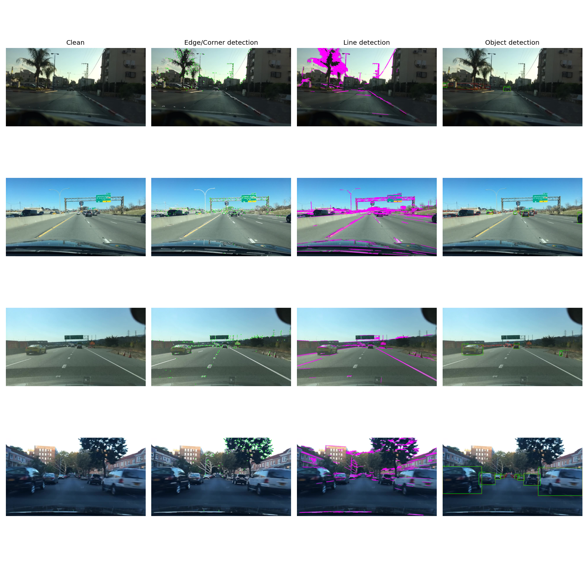
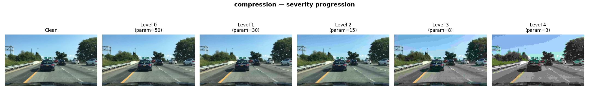
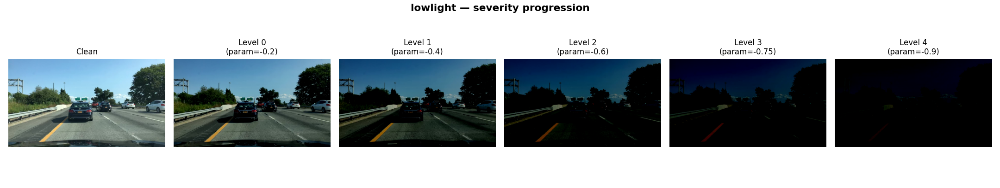
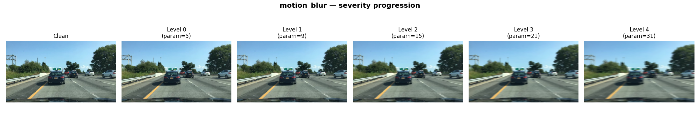
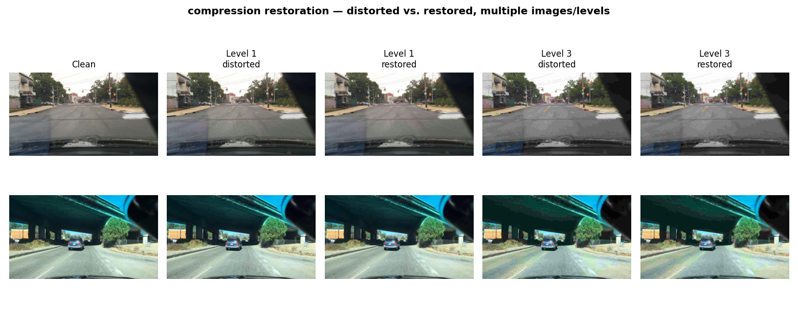
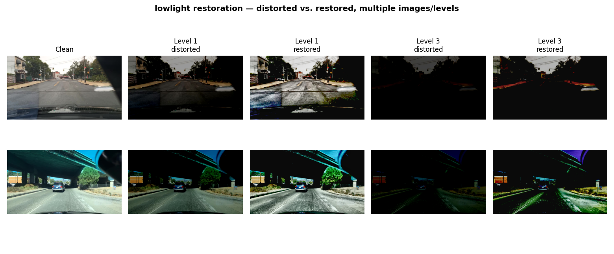
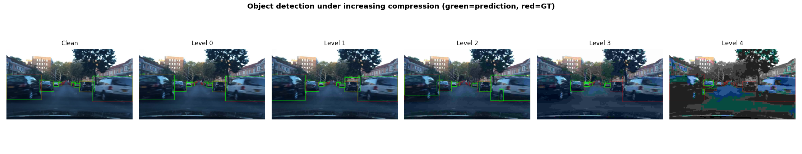
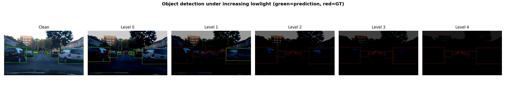
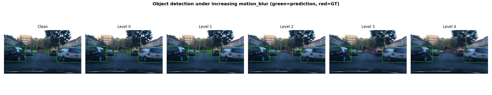

# Robustness of Vision Algorithms Under Real-World Image Distortions

**Course project — Digital Image Processing & Computer Vision (classical + deep learning)**

## Abstract

This project evaluates how three computer vision tasks — two classical algorithms and
one deep-learning model — degrade under three realistic image distortions (JPEG
compression, low-light, motion blur), whether classical restoration can recover lost
performance, and whether fine-tuning a detector on distorted data helps. Evaluation
runs on a 150-image subset of BDD100K (real driving footage) across five calibrated
severity levels per distortion, with object detection scored against real
ground-truth bounding boxes and the two classical tasks scored against their own
clean-image baseline. Motion-blur restoration is further broken out into an explicit
three-method comparison (two Wiener-deconvolution variants and Richardson-Lucy),
because no single image-quality metric agreed with the others on which method actually
helped the downstream task — a result treated as a finding in its own right rather
than smoothed over. The report is organized around what was actually found: the
visual effect of each distortion and restoration on real images, the measured
numbers behind those effects, and the mathematics of the algorithms that produced
them. All numbers and figures in this document come from real runs on real data; none
are simulated or illustrative placeholders.

---

## Table of Contents

1. [Introduction](#1-introduction)
2. [Project Pipeline](#2-project-pipeline)
3. [Dataset](#3-dataset)
4. [Methodology](#4-methodology)
   - [4.1 Pipeline Architecture](#41-pipeline-architecture)
   - [4.2 Tasks](#42-tasks)
   - [4.3 Distortions](#43-distortions)
   - [4.4 Restoration Methods](#44-restoration-methods)
   - [4.5 Restoration Method Comparison (Motion Blur)](#45-restoration-method-comparison-motion-blur)
   - [4.6 Fine-Tuning](#46-fine-tuning)
5. [Results](#5-results)
   - [5.1 Summary Table](#51-summary-table)
   - [5.2 Robustness Curves](#52-robustness-curves)
   - [5.3 Key Findings](#53-key-findings)
   - [5.4 Verifying the Counter-Intuitive Results](#54-verifying-the-counter-intuitive-results)
   - [5.5 Fine-Tuning Results](#55-fine-tuning-results)
6. [Limitations](#6-limitations)
7. [Development Log](#7-development-log)
8. [Reproducing This Project](#8-reproducing-this-project)
   - [8.1 Repository Structure](#81-repository-structure)
   - [8.2 Environment and Setup](#82-environment-and-setup)
   - [8.3 Usage](#83-usage)
9. [Credits and License](#9-credits-and-license)

---

## 1. Introduction

Vision systems deployed in the real world rarely see the clean, well-lit images they
were trained on. This project asks a concrete question: **for a small set of common
vision tasks, how much does performance actually degrade under realistic distortions,
can standard classical restoration techniques recover any of it, and does fine-tuning
help?** Rather than assume the answers, everything here is measured directly.

**Project summary:**

| # | Aspect | Choice | Rationale |
|---|--------|--------|-----------|
| 1 | Dataset | [BDD100K](https://doc.bdd100k.com/), 150-image subset (`train` split) | Real driving footage with genuine detection ground truth; see [§3](#3-dataset) |
| 2 | Tasks | Edge/Corner detection, Line detection, Object detection | 2 low-level (classical) + 1 high-level (DL); see [§4.2](#42-tasks) |
| 3 | Methods | Canny + Shi-Tomasi/ORB, Canny + Hough Transform, YOLOv8n | Existing, standard library implementations only |
| 4 | Distortions | JPEG compression, low-light, motion blur | Directly relevant to dashcam/driving conditions; see [§4.3](#43-distortions) |
| 5 | Severity | 5 calibrated levels per distortion, measured in PSNR (dB) | See [§4.3](#43-distortions) |
| 6 | Restoration | Bilateral deblocking, Gamma+CLAHE, Wiener deconvolution (tuned) | See [§4.4](#44-restoration-methods)–[§4.5](#45-restoration-method-comparison-motion-blur) |
| 7 | Fine-tuning | YOLOv8n only | The classical tasks have no trainable weights; see [§4.6](#46-fine-tuning) |

The full pipeline this project implements is laid out next, in [§2](#2-project-pipeline), before any methodology detail — it's the shape everything else in this document hangs off of.

---

## 2. Project Pipeline

Every one of the 150 images in this project moves through the same seven-stage
pipeline. This is the shape of the whole project — the rest of this document
(Methodology, Results) is organized around these stages in order.

```
                 Clean Images
                      │
                      ▼
             Baseline Evaluation
                      │
      ┌───────────────┼───────────────┐
      ▼               ▼               ▼
 Compression      Low Light      Motion Blur
      │               │               │
      ▼               ▼               ▼
   Evaluation     Evaluation     Evaluation
      │               │               │
      └───────────────┼───────────────┘
                      ▼
              Image Restoration
                      │
                      ▼
             Evaluation Again
                      │
                      ▼
          Fine-tuned YOLOv8 Models
                      │
                      ▼
            Final Performance Comparison
```

**What happens at each stage:**

| Stage | What happens | Where it's covered |
|---|---|---|
| **Clean images** | 150 real driving photos (BDD100K), no modification | [§3 Dataset](#3-dataset) |
| **Baseline evaluation** | All 3 tasks (edge/corner, line, object detection) run on the clean images — this is the reference every later number is measured against | [§4.2 Tasks](#42-tasks) |
| **Compression / Low Light / Motion Blur** | Each clean image is degraded three separate ways, five severity levels each | [§4.3 Distortions](#43-distortions) |
| **Evaluation** (per distortion) | All 3 tasks re-run on every distorted image, compared back to the clean baseline | [§5.1](#51-summary-table), [§5.2](#52-robustness-curves) |
| **Image restoration** | A classical restoration method matched to each distortion attempts to undo the damage | [§4.4](#44-restoration-methods), [§4.5](#45-restoration-method-comparison-motion-blur) |
| **Evaluation again** | All 3 tasks re-run on the *restored* images, to see how much of the lost performance came back | [§5.1](#51-summary-table), [§5.3](#53-key-findings) |
| **Fine-tuned YOLOv8 models** | The object detector is fine-tuned directly on distorted images and re-evaluated on a held-out set | [§4.6 Fine-tuning](#46-fine-tuning), [§5.5](#55-fine-tuning-results) |
| **Final performance comparison** | Clean vs. distorted vs. restored vs. fine-tuned, side by side, per task, per distortion, per severity level | [§5 Results](#5-results) |

Two things worth flagging about this diagram up front, both explained in full later:

- The two classical tasks (edge/corner, line detection) have no ground truth to
  compare against, so their "evaluation" boxes measure robustness against the *clean
  image's own output* rather than an annotated answer key. Object detection is scored
  against real BDD100K ground-truth boxes instead. Both are explained in
  [§4.2](#42-tasks).
- "Image restoration" is not one fixed method for motion blur — three different
  restoration algorithms were tried and are compared explicitly, because the choice
  turned out to matter more than expected. See [§4.5](#45-restoration-method-comparison-motion-blur).

---

## 3. Dataset

This project uses a **150-image subset of BDD100K** (`train` split), with matching
detection labels. BDD100K was chosen after two other candidates turned out to be
impractical:

- **Cityscapes**: requires a login-gated download with no way to script around it.
- **KITTI**: the same login requirement applies to the packages needed here.
- **BDD100K**: also login-gated for bulk download, but a subset downloaded locally is
  trivial to filter and hand off — see [§7](#7-development-log) for exactly how this
  was done, including filtering a ~1 GB label file down to what was actually needed.

**GT sanity check.** Before trusting the label file, its boxes were rendered onto a
sample image to visually confirm the coordinates line up correctly:


*Green = model prediction, red = ground truth; clean image (left) vs. the same image
under severe low-light distortion (right).*

**Class distribution** in this 150-image subset (after mapping BDD100K's 10 classes
onto COCO's 80 — see [§4.2](#42-tasks)):

| Class | Instances |
|---|---|
| car | 1543 |
| traffic light | 400 |
| truck | 83 |
| bus | 43 |
| person | 13 |

The imbalance (dominated by cars/traffic lights; zero bicycle/motorcycle/train
instances) is a known limitation of a 150-image sample — see [§6](#6-limitations).

---

## 4. Methodology

### 4.1 Pipeline architecture

The full pipeline diagram and stage-by-stage explanation is in
[§2](#2-project-pipeline). In numbers: 150 images × (1 clean + 3 distortions × 5
severity levels × 2 stages [distorted, restored]) → **4,650 result rows** in
`results/tables/full_results.csv`, plus the separate fine-tuning evaluation
([§4.6](#46-fine-tuning), [§5.5](#55-fine-tuning-results)).

### 4.2 Tasks

**Edge/Corner detection** (low-level, classical).

*Canny edge detection* (`cv2.Canny`) proceeds in four steps: (1) Gaussian smoothing
$I_s = I * G_\sigma$ to suppress noise; (2) gradient estimation via Sobel kernels,
giving magnitude $M(x,y)=\sqrt{G_x^2+G_y^2}$ and direction
$\theta(x,y)=\text{atan2}(G_y,G_x)$; (3) non-maximum suppression, keeping a
pixel only if $M$ is a local maximum along $\theta$; (4) hysteresis thresholding with
two thresholds $T_{low} < T_{high}$ — pixels above $T_{high}$ are edges, pixels between
the two thresholds are edges only if connected to a pixel already accepted.

*Shi-Tomasi corners* (`cv2.goodFeaturesToTrack`) use the local structure tensor over a
window $\Omega$:

$$M(x,y) = \sum_{\Omega} \begin{pmatrix} I_x^2 & I_xI_y \\ I_xI_y & I_y^2 \end{pmatrix}$$

with eigenvalues $\lambda_1, \lambda_2$. A point is a corner if
$R = \min(\lambda_1, \lambda_2)$ exceeds a threshold — both principal curvatures must
be large, unlike an edge (one large, one near zero) or a flat region (both near zero).
(Harris' corner detector uses $R = \det(M) - k \cdot \text{trace}(M)^2$
instead; Shi-Tomasi's criterion is what OpenCV implements here.)

*ORB* (`cv2.ORB_create`) combines: FAST keypoint detection (a pixel $p$ is a corner
candidate if $\geq 9$ contiguous pixels on a radius-3 Bresenham circle around it are
all brighter than $I(p)+t$ or all darker than $I(p)-t$); an orientation estimate from
the intensity centroid ($\theta = \text{atan2}(m_{01}, m_{10})$, where
$m_{pq}=\sum x^p y^q I(x,y)$ are patch moments); and rotated BRIEF, a 256-bit binary
descriptor from pairwise intensity comparisons at the patch orientation. Matching uses
Hamming distance between descriptors.

No ground truth exists for "correct" edges/corners, so robustness is measured against
the **clean image's own output** as a reference:
- **Edge IoU**: rasterize both Canny edge maps to binary masks $A$ (clean) and $B$
  (distorted/restored), dilate slightly to tolerate sub-pixel shifts, then
  $\text{IoU}(A,B) = |A \cap B| / |A \cup B|$.
- **Corner count ratio**: $n_{\text{corners}}(\text{other}) / n_{\text{corners}}(\text{clean})$.
- **ORB match ratio**: fraction of clean-image keypoints with a good Hamming-distance
  descriptor match in the other image.

**Line detection** (low-level, classical) — `cv2.Canny` → `cv2.HoughLinesP`. The
(non-probabilistic) Hough transform represents a line in normal form
$\rho = x\cos\theta + y\sin\theta$; every edge pixel casts a vote for every $(\rho,\theta)$
line passing through it into an accumulator array, and peaks in the accumulator are
detected lines. The probabilistic variant used here (`HoughLinesP`) samples edge points
rather than voting exhaustively and additionally checks pixel connectivity, returning
actual line segments (endpoints) rather than infinite lines. This replaced an
originally-planned optical-flow/tracking task, dropped because it required consecutive
video frames that weren't available (see [§7](#7-development-log)). Same
vs.-clean-reference philosophy as above: line-count ratio + rasterized line-mask IoU.

**Object detection** (high-level, deep learning) — `ultralytics.YOLO("yolov8n.pt")`,
COCO-pretrained, unmodified except in Stage 4. YOLOv8 is a single-stage, anchor-free
detector: a CSPDarknet-style backbone extracts multi-scale features, a PAN-FPN neck
fuses them across scales (top-down then bottom-up), and a decoupled head predicts
class probabilities and box coordinates independently at each scale. Box regression
uses Distribution Focal Loss — rather than regressing each box edge directly, the model
predicts a discrete probability distribution over candidate offsets and takes its
expectation, which empirically gives better-calibrated, more stable regression than
direct coordinate regression. Training loss combines this with a CIoU loss for box
overlap quality:

$$\mathcal{L}_{CIoU} = 1 - \text{IoU} + \frac{\rho^2(b, b_{gt})}{c^2} + \alpha v$$

where $\rho$ is the distance between predicted and ground-truth box centers, $c$ is the
diagonal of the smallest enclosing box, and $v$ penalizes aspect-ratio mismatch.

This is the one task with **real ground truth**, scored properly rather than with a
self-referential proxy:

$$\text{Precision} = \frac{TP}{TP+FP}, \quad \text{Recall} = \frac{TP}{TP+FN}, \quad
F_1 = \frac{2 \cdot \text{Precision} \cdot \text{Recall}}{\text{Precision}+\text{Recall}}$$

A prediction counts as a true positive (TP) if it matches a ground-truth box of the
same class with $\text{IoU} \geq 0.5$ (greedy matching, highest-IoU-first, each GT box
usable once); unmatched predictions are false positives (FP), unmatched GT boxes are
false negatives (FN).

BDD100K's 10 detection classes don't exactly match COCO's 80, so the overlapping ones
are mapped and the rest dropped:

| BDD100K class | → COCO class |
|---|---|
| pedestrian, rider | person |
| car | car |
| truck | truck |
| bus | bus |
| train | train |
| motorcycle | motorcycle |
| bicycle | bicycle |
| traffic light | traffic light |
| traffic sign | *(dropped — no COCO equivalent)* |

**All three tasks, on four different clean images:**


*Each row is a different image from the dataset. Left to right: the clean photo,
Canny edges (white) with Shi-Tomasi corners (green dots), Hough-detected lines
(magenta), and YOLOv8n detections (green boxes with class + confidence). This is the
baseline every distortion/restoration number in [§5](#5-results) is measured against —
worth looking at before seeing what distortion does to it.*

### 4.3 Distortions

All three are directly relevant to driving/dashcam footage. Each has 5 fixed severity
levels (parameter values chosen for a good spread in signal quality, not per-image
calibrated):

| Distortion | Library call | Severity levels (param) | Resulting PSNR range (this dataset) |
|---|---|---|---|
| Compression | `cv2.imencode('.jpg', ..., IMWRITE_JPEG_QUALITY)` | quality = 50, 30, 15, 8, 3 | ~39 → ~24 dB |
| Low-light | `albumentations.RandomBrightnessContrast` | brightness = -0.2 … -0.9 | ~18 → ~7 dB |
| Motion blur | custom linear kernel + `cv2.filter2D` | kernel length = 5, 9, 15, 21, 31 px | ~33 → ~25 dB |

Motion blur uses a **known, controlled linear kernel** (not a black-box random blur),
so restoration can be genuine non-blind deconvolution rather than blind guesswork. The
spatial-domain blur model is $g = h * f$, a convolution of the clean image $f$ with a
normalized linear kernel $h$ of the given length (all weight along one line, oriented
horizontally here — see [§4.5](#45-restoration-method-comparison-motion-blur)).

Image quality is measured as PSNR (dB) between clean and distorted images:

$$\text{MSE} = \frac{1}{N}\sum (I_{clean} - I_{distorted})^2, \qquad
\text{PSNR} = 10\log_{10}\!\left(\frac{255^2}{\text{MSE}}\right)$$

the same $10\log_{10}(P_{signal}/P_{noise})$ "SNR" formula referenced in the course
material, generalized here from the pure-additive-noise case (where it was originally
defined) to any pixel-domain distortion — compression and blur aren't additive noise,
but the same ratio-of-powers logic still quantifies how far a distorted image is from
the clean reference.

**Severity progression, one distortion at a time** (clean, then levels 0–4 in order):


*JPEG compression: mild levels are barely visible; by level 3–4 blocking artifacts and
color banding (visible in the sky) become obvious.*


*Low-light: brightness drops steeply even by level 1–2, and by level 3–4 most of the
frame is close to pure black — this is why detection collapses so early for this
distortion (see [§5.3](#53-key-findings)).*


*Motion blur: the kernel length increases from 5px to 31px — by the last level, edges
that were sharp in the clean image are smeared well beyond recognition.*

**Visual example** (most severe level of each distortion, plus restoration):


*Rows top to bottom: compression, low-light, motion blur, each shown at its most
severe level (columns: clean, distorted, restored). Compression restoration is
subtle by design (deblocking only). Low-light restoration visibly recovers visible
structure — but see [§5.4](#54-verifying-the-counter-intuitive-results) for why that
doesn't necessarily help the detector. Motion-blur restoration removes the visible
blur trails.*

### 4.4 Restoration methods

| Distortion | Method | Why |
|---|---|---|
| Compression | Bilateral filter on the Y (luma) channel only | Smooths blocking artifacts while preserving color and most edges |
| Low-light | Gamma correction (γ=0.35) + CLAHE on the L channel | Lifts shadow detail, then boosts local contrast without blowing out highlights |
| Motion blur | Wiener deconvolution, known kernel, regularization tuned per severity level | Best detection F1 of three methods explicitly compared — see §4.5 |

**Bilateral filter** (compression deblocking) replaces each pixel with a weighted
average of its neighborhood, weighting by both spatial proximity and intensity
similarity, which lets it smooth flat regions (where JPEG blocking artifacts appear)
while leaving genuine edges alone:

$$I'(x) = \frac{1}{W_x}\sum_{x_i \in \Omega} I(x_i)\, G_{\sigma_s}(\lVert x-x_i\rVert)\, G_{\sigma_r}(|I(x)-I(x_i)|)$$

where $G_{\sigma_s}$ is a spatial Gaussian (nearby pixels weighted more), $G_{\sigma_r}$
is a range/intensity Gaussian (similar-intensity pixels weighted more, so it doesn't
blur across a real edge), and $W_x$ normalizes the weights to sum to 1.

**Gamma correction** (low-light) applies a power-law remap to lift dark pixels:
$I' = 255 \cdot (I/255)^\gamma$ with $\gamma=0.35 < 1$, which expands the dark end of
the range disproportionately (e.g. a pixel at 10% brightness moves to roughly 30%,
while a pixel at 90% only moves to about 96%).

**CLAHE** (Contrast-Limited Adaptive Histogram Equalization, applied after gamma, on
the L channel) equalizes the local histogram independently within small tiles (8×8
here) rather than globally, so it boosts contrast differently in dark vs. bright
regions of the same image, with bilinear interpolation between tile boundaries to avoid
blocking artifacts. The *clip limit* caps how much any single intensity bin can be
amplified — before computing each tile's histogram-equalization mapping, bin counts
above the clip limit are redistributed across the histogram — which exists specifically
to prevent noise over-amplification in flat/noisy regions. As
[§5.3, finding 3](#53-key-findings) shows, that safeguard doesn't fully prevent it on
the most severely underexposed images in this dataset.

**Restoration in practice, multiple images and severities** (compression and
low-light; motion blur gets its own full comparison in [§4.5](#45-restoration-method-comparison-motion-blur)):


*Two images, at severity levels 1 (mild) and 3 (severe). Deblocking is subtle at every
level by design — it's meant to smooth blocking artifacts, not add detail — but the
difference is visible on close inspection at level 3.*


*Same two images, low-light levels 1 and 3. Restoration clearly recovers visible
brightness and structure at both levels — a much bigger visual change than the
compression case above. Whether that visual improvement translates to better
detection is a separate question, answered (not favorably) in
[§5.4](#54-verifying-the-counter-intuitive-results).*

**Task overlay example** (edges/corners and lines, clean vs. severely motion-blurred):


*Top row: Canny edges (white) and Shi-Tomasi corners (green dots), clean vs. severely
motion-blurred — blur both erases real edges/corners and, in flatter regions,
occasionally invents new spurious ones. Bottom row: Hough-detected lines (magenta) on
the same pair — line count and length both drop sharply once the underlying edges are
gone.*

### 4.5 Restoration method comparison (motion blur)

Motion-blur restoration is the one place in this project where the "obvious" choice
changed more than once. Rather than only report the final answer, all three attempts
are kept side by side in `restoration.py` (`MOTION_BLUR_METHODS`) and compared
explicitly across all 150 images and all 5 severity levels
(`results/tables/motion_blur_method_comparison.csv`).

**Wiener deconvolution.** Modeling the blur as $g = h*f+n$ (clean image $f$, known blur
kernel $h$, noise $n$), the Wiener filter estimates $f$ in the frequency domain as

$$\hat{F}(u,v) = \left[\frac{H^*(u,v)}{|H(u,v)|^2 + K}\right] G(u,v)$$

where $H$, $G$ are the Fourier transforms of the kernel and blurred image, and $K$ (the
`balance` parameter here) is a regularization constant standing in for the
noise-to-signal power ratio.

**Why it gets worse as the blur kernel gets longer.** A linear motion-blur kernel of
length $L$ has a sinc-shaped frequency response $H$ with *zeros* spaced roughly $1/L$
apart in frequency — the longer the kernel, the more zeros, more densely packed. Near
each zero ($H \to 0$), $\hat{F}$ blows up unless $K$ is large enough to dominate the
denominator there; for a horizontal kernel this noise blow-up shows up as periodic
*vertical* stripes in the spatial domain (verified quantitatively below). A single $K$
is one global trade-off between suppressing that blow-up and actually deblurring — for
a long kernel with many closely-spaced zeros, no single value works well everywhere.

**Richardson-Lucy deconvolution**, the alternative compared here, instead solves the
same $g=h*f$ model iteratively under a Poisson-noise maximum-likelihood formulation:

$$f_{k+1}(x) = f_k(x) \cdot \left[\left(\frac{d}{h * f_k}\right) \star h\right](x)$$

where $d$ is the observed (blurred) image and $\star$ denotes correlation with the
flipped kernel. This has no frequency-domain division, so it doesn't hit the same hard
singularity — but it converges toward an unconstrained maximum-likelihood estimate that
increasingly fits noise the longer it runs, so the iteration count $k$ (fixed at 3
here) is itself the regularization knob (early stopping), in place of Wiener's $K$.

**The three methods compared:**

| Method | Description |
|---|---|
| `wiener_fixed` | Wiener deconvolution, single fixed `balance=0.02` (the initial, naive attempt) |
| `wiener_tuned` | Wiener deconvolution, `balance` scaled up for longer kernels via a hand-tuned lookup table |
| `richardson_lucy` | Richardson-Lucy deconvolution, fixed at 3 iterations (iteration count is itself the regularization — early stopping) |

**Aggregate results (all 150 images, all 5 severity levels):**

| Method | PSNR (dB) | Stripe score (artifact, lower=cleaner) | Edge IoU | Line IoU | Detection F1 |
|---|---|---|---|---|---|
| *(distorted, no restoration)* | 27.66 | 0.54 | 0.443 | 0.356 | 0.323 |
| `wiener_fixed` | 25.70 | 2.78 | **0.625** | **0.494** | 0.311 |
| `wiener_tuned` | **28.31** | 1.49 | 0.513 | 0.399 | **0.357** |
| `richardson_lucy` | 27.58 | 2.04 | 0.479 | 0.371 | 0.291 |

No method wins on every metric — that disagreement *is* the finding. `wiener_fixed` has
the best structural recovery (edge/line IoU) on average, `wiener_tuned` has the best
PSNR and by far the best detection F1, and `richardson_lucy` isn't actually the best on
anything in aggregate despite being the simplest to configure (one iteration count, no
per-level lookup table).

**Where it really falls apart — per severity level:**

| Level (kernel) | Method | PSNR | Stripe score | Detection F1 |
|---|---|---|---|---|
| 4 (31px, most severe) | distorted | 24.17 | 0.34 | 0.172 |
| 4 | `wiener_fixed` | **16.53** | **4.23** | **0.017** |
| 4 | `wiener_tuned` | 23.33 | 1.36 | 0.199 |
| 4 | `richardson_lucy` | 23.97 | 1.32 | 0.104 |

At the most severe level, `wiener_fixed` doesn't just underperform — it nearly destroys
detection entirely (F1 0.017), exactly as the frequency-domain explanation above
predicts: the longest kernel has the most tightly packed frequency-response zeros, and
a regularization value tuned for short kernels is far too weak there. Both
`wiener_tuned` and `richardson_lucy` avoid that collapse, but `richardson_lucy` —
despite better stripe/PSNR numbers — still ends up with *worse* detection F1 than
`wiener_tuned` at this level (0.104 vs. 0.199), and worse than doing nothing at all
(0.172).

**Visual comparison** (clean / distorted / all three restorations, at increasing severity):


*Rows are severity levels 1, 3, and 4 (mild to severe); columns are clean, distorted,
and all three restoration attempts. Watch the "Wiener (fixed)" column at the two most
severe rows — the vertical striping is the ringing artifact explained above, visible
directly rather than just as a number.*

**Metric trends across severity, all methods overlaid:**


*Restoration quality (PSNR) by method across severity. `wiener_tuned` (its own color
in the legend) has the best PSNR at every level; `wiener_fixed` collapses sharply at
the most severe level — the point where the striping above becomes visible.*


*Artifact/ringing severity by method (log scale, lower = cleaner). `wiener_fixed`
spikes an order of magnitude higher than the other two methods at severe levels —
this is the quantitative signature of the visible striping.*


*The metric that matters most: detection F1 against real ground truth, by method.
`wiener_tuned` is the only method that consistently beats "no restoration at all"
(the grey distorted-baseline line) — the other two both fall below it at higher
severity, despite one of them (Richardson-Lucy) having better PSNR/stripe numbers.*

**Takeaway.** `wiener_tuned` is used as the production restoration method for this
project's headline results ([§5](#5-results)) because it has the best detection F1 —
the metric with real ground truth, and therefore the one trusted most here. But it
required the most manual tuning (a per-severity-level lookup table), and the
convenience of "just tune the regularization" only goes so far, as `wiener_fixed`'s
collapse at the most severe level shows. `richardson_lucy` is simpler to configure and
looks cleanest to a human eye or a generic image-quality metric, and would be the
reasonable choice if this were purely an image-quality task — it just isn't the best
choice for *this* task. Which restoration method is "best" depends entirely on what is
being optimized for.

### 4.6 Fine-tuning

Stage 4 fine-tunes `yolov8n.pt` on a small set of distorted images and re-evaluates on
a held-out distorted set never seen during training — object detection is the only
task fine-tuned, since edge/corner and line detection are classical algorithms with no
trainable weights. Two attempts were made (see [§7](#7-development-log) for the full
story); the second (`finetune_run_v2.py`) is the production version, using a frozen
backbone (`freeze=10`) and disabled mosaic augmentation, both standard small-data
fine-tuning practices. Training runs entirely on CPU (`device="cpu"`), 8 epochs, and
completes in well under 5 minutes. Results are in [§5.5](#55-fine-tuning-results).

---

## 5. Results

### 5.1 Summary table

Averaged across all 150 images and all 5 severity levels:

| Distortion | Stage | SNR (dB) | Edge IoU | Line IoU | Det. Precision | Det. Recall | Det. F1 |
|---|---|---|---|---|---|---|---|
| — | clean | ∞ | 1.000 | 1.000 | 0.691 | 0.369 | **0.450** |
| compression | distorted | 31.8 | 0.792 | 0.651 | 0.560 | 0.265 | 0.335 |
| compression | restored | 30.0 | 0.601 | 0.461 | 0.603 | 0.290 | **0.367** |
| lowlight | distorted | 9.4 | 0.364 | 0.284 | 0.341 | 0.124 | **0.166** |
| lowlight | restored | 12.2 | 0.354 | 0.298 | 0.314 | 0.116 | 0.154 |
| motion_blur | distorted | 27.7 | 0.443 | 0.356 | 0.648 | 0.241 | 0.323 |
| motion_blur | restored | 28.3 | 0.513 | 0.399 | 0.639 | 0.275 | **0.357** |

Full per-image, per-level data: `results/tables/full_results.csv` (4,650 rows).

### 5.2 Robustness curves

Metric vs. SNR, distorted vs. restored:


*Edge/corner robustness (vs. the clean image's own output) for each distortion,
distorted (solid) vs. restored (dashed). Compression and motion-blur restoration both
pull the curve back toward the clean baseline; low-light restoration is roughly
neutral on this purely structural metric even though it changes the image a lot.*


*Same comparison for Hough line detection. The pattern closely tracks edge IoU above,
which makes sense — line detection here is built directly on top of Canny edges, so
whatever helps or hurts edges propagates through to lines.*


*The high-level task: object detection F1 against real BDD100K ground truth — the
only chart on this page backed by an annotated answer key rather than a
clean-image-as-reference proxy. This is the chart the findings below are mainly
about.*

**Qualitative view: the same story, seen directly on an image rather than as a curve.**
One image with 8 clean-baseline detections, run through all 5 severity levels of each
distortion:


*8 detections on the clean image drop to 2 by the most severe compression level —
mostly the smaller/more distant objects lose their boxes first as detail degrades.*


*The steepest collapse of the three: down to 1 detection by level 1 and zero from
level 2 onward — consistent with the robustness curve above showing low-light as the
most damaging distortion for this task.*


*A less monotonic pattern than the other two (10 detections at level 1, actually more
than the clean baseline's 8, before dropping to 3 by level 3-4) — a reminder that
these are real per-image numbers, not a smoothed trend; the aggregate curve above is
what should be trusted for the overall pattern, not any single image.*

### 5.3 Key findings

1. **Clear degradation with severity.** All three tasks degrade monotonically as SNR
   drops — e.g. compression detection F1 falls from 0.449 (mild, 39 dB) to 0.151
   (severe, 24 dB).

2. **Restoration helps most exactly when things are worst.** For compression, deblocking
   barely changes F1 at mild severity (0.449→0.444) but meaningfully helps at severe
   levels (0.151→0.235). There's little to fix when damage is minor.

3. **Pixel-quality metrics and downstream task performance don't always agree.**
   Low-light restoration *improves* SNR (9.4→12.2 dB) but *slightly hurts* detection F1
   (0.166→0.154). This was specifically re-verified rather than taken at face value —
   see [§5.4](#54-verifying-the-counter-intuitive-results).

4. **The "cleanest-looking" restoration isn't always the best one.** Full breakdown in
   [§4.5](#45-restoration-method-comparison-motion-blur): Richardson-Lucy looks
   cleanest and has the best PSNR/stripe scores in several conditions, but has the
   **worst detection F1 of the three methods compared** (0.291, below even doing
   nothing at 0.323). This was also independently re-verified — see
   [§5.4](#54-verifying-the-counter-intuitive-results).

5. **Baseline domain gap.** Even on *clean* images, stock COCO-pretrained YOLOv8n only
   reaches F1=0.45 against BDD100K's real GT — expected, since BDD100K's camera
   angle/height and object scale differ from COCO's training distribution. This
   motivates fine-tuning ([§5.5](#55-fine-tuning-results)).

### 5.4 Verifying the counter-intuitive results

Findings 3 and 4 both say a restoration step made a downstream result *worse* than
leaving the image alone, which is worth being skeptical of by default — that shouldn't
happen from a genuine bug, and it's exactly the kind of surprising result that turned
out, once before in this project, to actually be one (see
[§7](#7-development-log)). So rather than report it and move on, it was checked.

**Ruled out: data corruption.** Restored images could in principle end up a different
shape or dtype than the original (which would silently misalign ground-truth box
coordinates and produce spurious detection failures). Verified directly: every
distortion/restoration combination preserves the exact `(H, W, 3)` `uint8` shape and
dtype of the input — confirmed programmatically across all three distortions at both
mild and severe levels before trusting any downstream number.

**What's actually happening: both cases are noise/artifact amplification, confirmed
quantitatively, not asserted.** The check used is the Laplacian variance of the
grayscale image, $\text{Var}(\nabla^2 I)$ — a standard focus/noise proxy: real
image detail and injected noise both increase it, but injected noise increases it
*without* corresponding real structure.

- **Low-light (CLAHE).** One concrete example: an image with 2 correct traffic-light
  detections on the distorted (dark) frame (F1=0.667) drops to **zero** detections
  after restoration (F1=0.000) — despite mean brightness genuinely improving (11.3 →
  38.0, still short of the clean image's 104.9). The Laplacian variance in a flat
  region of that same image: clean = 456, distorted = 211, **restored = 1451** — over
  3× more high-frequency energy than the *clean* image itself has, injected by CLAHE's
  per-tile local contrast boost amplifying sensor noise in a near-black, low-SNR region
  (exactly the failure mode the clip limit in [§4.4](#44-restoration-methods) exists to
  prevent, and doesn't fully). Checked at scale, not just this one image: across 40
  images at severity level 3, mean Laplacian variance is 388 (clean) / 33 (distorted) /
  **540 (restored)** — restored exceeds the clean image's own natural texture level in
  **35 of 40 images (87.5%)**.

- **Motion blur (Richardson-Lucy).** One concrete example at the most severe level: the
  distorted frame yields 7 detections (F1=0.571); the production method
  (`wiener_tuned`) yields 5 *higher-confidence* detections (F1=0.667); Richardson-Lucy
  yields **1** low-confidence detection (F1=0.000). Laplacian variance: distorted = 48,
  `wiener_tuned` = 13 (heavy smoothing — this is *why* it works, removing ambiguous
  content), richardson_lucy = **57** — higher than the distorted image's own blur
  level. Checked at scale: across 40 images at the most severe level,
  **Richardson-Lucy's output exceeds the distorted image's Laplacian variance in 39 of
  39 images with any ground truth (100%)**.

**An honest caveat.** The *magnitude* of excess noise only weakly correlates with the
*size* of the F1 drop at the individual-image level (Pearson r ≈ −0.13 to −0.14 in both
cases, tested directly rather than assumed). The mechanism — restoration algorithms
optimizing for pixel fidelity or human perception can inject high-frequency content
that a detector never saw in training, and that detector's response to it is a
nonlinear function of the network, not simply proportional to how much noise was added
— is real, consistently present in aggregate, and directly measured here. But it is not
being overstated as a clean per-image predictive rule.

**Why this isn't specific to a bad implementation.** This is a documented, general
tension in the image restoration literature: methods evaluated by pixel fidelity
(PSNR/SSIM) or human perceptual quality are not the same thing as methods that help a
frozen, pretrained downstream model, because that model's sensitivity to
out-of-distribution artifacts doesn't have to track either metric. This project's
results are a small, directly-measured instance of that general gap, not an isolated
implementation error — which is also why the "obviously best" restoration method
changed twice during development (§7) before landing on the one that actually helps the
metric that matters here (real detection ground truth) rather than the one that looks
cleanest.

### 5.5 Fine-tuning results


*Detection F1, baseline (pretrained) vs. fine-tuned, broken down by distortion type.
The bars sit close together in every group — a visual confirmation of the "no clear
win" finding below, rather than a dramatic before/after.*

| | Precision | Recall | F1 |
|---|---|---|---|
| Baseline (pretrained) | 0.515 | 0.201 | **0.267** |
| Fine-tuned | 0.443 | 0.214 | 0.261 |

**Honest result: fine-tuning did not clearly help.** Overall F1 is essentially flat
(0.267 → 0.261), with a small recall gain traded for a precision drop. Per distortion,
results are mixed: compression improved slightly (0.329→0.339), low-light got worse
(0.154→0.134), motion blur stayed about flat (0.317→0.311).

This is reported as a legitimate finding, not a failure to hide. The fine-tuning set is
small (40–50 training images, 5–8 epochs, CPU-only) — matching this course's explicit
"small scale" allowance — which is squarely the regime where catastrophic forgetting
can outweigh adaptation benefits. Plausible next steps (not attempted here, by choice):
more training images, more epochs, or a manually-tuned rather than auto-selected
learning rate.

---

## 6. Limitations

- **Small scale by design.** 150 images total (100 held-out for baseline evaluation +
  50 for fine-tuning) is small by deep learning standards. This is a deliberate,
  explicitly-permitted choice for this course project — the pipeline itself scales to
  any number of images by construction.
- **Class imbalance.** This 150-image sample has zero bicycle/motorcycle/train
  instances and is dominated by cars and traffic lights (see [§3](#3-dataset)), so
  per-class metrics for rare classes aren't meaningful here.
- **Proxy metrics for 2 of 3 tasks.** Edge/corner and line detection have no ground
  truth, so robustness is measured against each image's own clean-image output rather
  than an external reference.
- **BDD100K → COCO class mapping is approximate.** "Rider" folds into "person";
  "traffic sign" has no COCO equivalent and is dropped entirely from GT matching.
- **Fine-tuning is a proof of concept**, not a production training run (see
  [§5.5](#55-fine-tuning-results), [§7](#7-development-log)).

---

## 7. Development Log

This section documents the actual friction points hit while building and later
hardening this project, and how each was resolved — kept in the spirit of documenting
the real process rather than only the polished final result. Technical detail that's
already covered elsewhere (e.g. the full restoration-method analysis in
[§4.5](#45-restoration-method-comparison-motion-blur)) is not repeated here; this
section focuses on the chronology and the mistakes.

**1. Dataset access.** Cityscapes and KITTI both require a login to download, which
blocked scripted/automated access. Resolved by switching to BDD100K, downloading it
manually, and filtering locally before uploading a small subset.

**2. Filtering a 1GB label file.** BDD100K's full label file
(`bdd100k_labels_images_train.json`, ~1GB, ~70k entries) was too big to hand off
directly. Fixed with a short local script that loads the full JSON once, filters to
just the 150 chosen image filenames, and writes a small (<1MB) `labels_subset.json`
matching the shape `task_detection.load_bdd_labels()` expects.

**3. Windows path + Python raw strings.** Running a local filter script on Windows hit
`SyntaxError: (unicode error) 'unicodeescape' codec can't decode bytes` — an unescaped
`\U` in a Windows path being interpreted as a Unicode escape sequence. Fixed with raw
strings (`r"C:\Users\..."`) or forward slashes.

**4. PyCharm interpreter misconfiguration.** `CreateProcess error=2` when running via
PyCharm — the run configuration pointed at a venv from an unrelated old project. Fixed
via `Settings → Python | Interpreter → Add Local Interpreter → New environment`.

**5. Fine-tuning evaluation bug (caching).** The first fine-tuning attempt
(`finetune_run.py`) produced *byte-identical* baseline and fine-tuned results. Root
cause: `task_detection.load_model()` caches YOLO model objects by weights path, and
calling `.train()` on a cached model mutates its weights **in place**. Since both the
training call and the later "baseline" evaluation went through the same cache,
"baseline" was silently evaluating the already-fine-tuned model. Fixed by loading two
fully independent `YOLO(...)` instances (bypassing the cache entirely) for any
before/after comparison — see `finetune_eval_fixed.py`.

**6. The same bug's second form (frozen-parameter false positive).** Verifying the fix
above by comparing a single model parameter is unreliable: with a frozen backbone
(`freeze=10`), the first parameter is *supposed* to be identical between baseline and
fine-tuned, and separately, YOLOv8's DFL layer is structurally fixed regardless of
training — so checking either one alone can report "no difference" even when training
worked correctly. Fixed by comparing across *all* named parameters instead of one
arbitrarily-chosen one. **This exact mistake was made twice**: once in the original
evaluation script (fixed in `finetune_eval_fixed.py`), and a second copy of the same
check was left unfixed in `finetune_run_v2.py` itself, which surfaced later as a live
`AssertionError: models identical - bug` crash immediately after a successful training
run on a clean machine. Both copies now use the corrected all-parameters check.

**7. Fine-tuning attempt 1 → attempt 2.** After fixing the evaluation bug, attempt 1's
real result was that fine-tuning *hurt* performance. Attempt 2 applied two standard
small-data fine-tuning practices — freezing the backbone and disabling mosaic/geometric
augmentation — plus broader distortion-type coverage in the training set. This narrowed
the gap but didn't produce a clear win (see [§5.5](#55-fine-tuning-results)). Reported
honestly rather than cherry-picked.

**8. Long-running batch jobs vs. tool call limits.** Processing 150 images through the
full pipeline takes 15–20+ minutes, and a background (`nohup ... &`) process didn't
survive between separate tool invocations in the sandbox this project was originally
built in. Fixed with a resumable batch design (`run_full.py` and siblings): each call
processes a bounded number of new images and checkpoints progress to disk, so a full
run can be split across several sequential calls without losing work.

**9. A visibly broken restoration result, chased across three attempts.** The
qualitative before/after figure for motion blur showed severe periodic vertical-stripe
artifacts — not subtle, clearly wrong on visual inspection. This became the
most-revisited part of the whole project: a naive fixed-regularization Wiener
deconvolution was tuned per severity level, which fixed the visible artifacts but still
underperformed doing nothing at the most severe level; Richardson-Lucy was then tried
and looked like a clean win on a single test image; a full 150-image comparison
(prompted specifically to keep and compare all attempts rather than report only the
final one) then showed Richardson-Lucy actually has the *worst* aggregate detection F1
of the three methods, and the tuned-Wiener approach — briefly abandoned along the way —
is the real winner. Full technical explanation, data, and figures are in
[§4.5](#45-restoration-method-comparison-motion-blur); the takeaway that generalizes is
that a single qualitative check, even a careful one, can point in the wrong direction,
and "looks cleaner" is a different thing from "helps the task," sometimes in direct
conflict.

**10. Hardcoded paths — the codebase didn't actually run anywhere else.** Nine files
that read or wrote data had absolute paths like `/home/claude/project/data/...`
hardcoded in, specific to the sandbox this project was originally built in. That path
doesn't exist on any other computer, so none of these scripts could run after a fresh
clone — a functional bug, not a style issue. Fixed by adding `src/config.py`, which
derives every path from its own location on disk, and updating every script to import
paths from there instead of hardcoding them. Verified by copying the entire project to
an arbitrary, differently-named directory and confirming the full pipeline still ran
correctly end-to-end with zero code changes.

---

## 8. Reproducing This Project

Everything above this point is the actual report: what was done, why, the math behind
it, and what was found. This section is the practical complement — how to get the code
running on your own machine if you want to reproduce or extend it. It's deliberately
placed at the end: the code is the *means* by which the results in
[§5](#5-results) were produced, not the point of the project.

### 8.1 Repository Structure

```
├── README.md                      <- this file
├── requirements.txt
├── LICENSE
├── src/                            <- all pipeline code
│   ├── config.py                    <- all paths, resolved relative to the repo (see §7)
│   ├── distortions.py               <- 3 distortions x 5 severity levels
│   ├── restoration.py               <- classical restoration per distortion (3 motion-blur variants kept side by side)
│   ├── metrics.py                   <- PSNR/SNR, detection P/R/F1, edge/line IoU, stripe/artifact score
│   ├── task_edge_corner.py          <- Task 1 (low-level, classical)
│   ├── task_lines.py                <- Task 2 (low-level, classical)
│   ├── task_detection.py            <- Task 3 (high-level, DL) + BDD100K GT loader
│   ├── pipeline.py                  <- orchestrates all 3 tasks x all distortions x all stages
│   ├── run_full.py                  <- resumable batch runner (used to process all 150 images)
│   ├── recompute_motion_blur_restore.py <- targeted recompute after restoration.py changes
│   ├── compare_motion_blur_methods.py   <- §4.5 ablation study across all 3 restoration methods
│   ├── finetune_utils.py            <- BDD100K GT -> YOLO label format conversion
│   ├── finetune_run.py              <- Stage 4, attempt 1 (see §7)
│   ├── finetune_run_v2.py           <- Stage 4, attempt 2 (frozen backbone, no mosaic) — production
│   ├── finetune_eval_fixed.py       <- corrected baseline-vs-finetuned evaluation
│   ├── make_figures.py              <- generates the main report figures
│   ├── make_slide_figures.py        <- slide-optimized versions of the key charts
│   ├── make_comparison_figures.py   <- §4.5 ablation study figures
│   └── make_gallery_figures.py      <- clean/task galleries, severity progressions, detection-across-severity, restoration grids
├── data/
│   └── raw/bdd_subset/
│       ├── images/                  <- 150 BDD100K images
│       └── labels_subset.json       <- matching detection GT (filtered from the ~1GB full file)
├── models/
│   ├── yolov8n.pt                   <- pretrained COCO weights (baseline)
│   └── yolov8n_finetuned.pt         <- fine-tuned on distorted images (Stage 4)
├── results/
│   ├── tables/                      <- all raw + summary CSVs
│   └── figures/                     <- all plots (referenced throughout this README)
├── presentation/
│   ├── build_deck.py                <- builds the final PPTX (pure Python, python-pptx)
│   ├── vision_robustness_presentation.pptx
│   └── assets/                      <- figures embedded in the deck
└── docs/
    └── (this README is the primary report)
```

---

### 8.2 Environment and Setup

This section covers everything needed to get the code running on a fresh machine.
Read this before anything else if you're cloning this repository for the first time.

#### Tested configuration

| Component | Tested value(s) |
|---|---|
| OS | Developed on Linux (Ubuntu-based); confirmed working on Windows 10/11 |
| Python | 3.12 (primary development/test target); confirmed also working on 3.14 |
| Hardware | CPU-only — no GPU/CUDA required |
| CPU used in testing | Intel Xeon (development), Intel Core i9-11900K (Windows verification) |

This project has **no GPU dependency**; every result in this README was produced on
CPU (~10–15 sec/image for the full pipeline, well under 5 minutes for fine-tuning). If
your machine has a CUDA-capable GPU, `ultralytics` will use it automatically for
inference without any code changes; fine-tuning explicitly forces `device="cpu"` for
portability (see [§4.6](#46-fine-tuning)) and would need a one-line edit in
`finetune_run_v2.py` to opt into GPU training.

#### Software requirements

- **Python 3.10–3.12 recommended** (this is the range `ultralytics`/`torch` officially
  target at time of writing). Newer versions may work — 3.14 has been confirmed to run
  this project successfully — but are outside the primary tested range, so if you hit
  an obscure dependency error on a very new Python version, trying 3.12 is a reasonable
  first troubleshooting step.
- All Python package dependencies are pinned to minimum versions in `requirements.txt`:
  `opencv-python-headless`, `numpy`, `albumentations`, `scikit-image`, `matplotlib`,
  `pandas`, `torch`, `torchvision`, `ultralytics`, `python-pptx`.
- No system-level dependencies beyond Python itself (no `ffmpeg`, no CUDA toolkit, no
  compiler toolchain required — all packages above ship prebuilt wheels for
  Windows/macOS/Linux).
- **Internet access is required** for the initial `pip install` and for `ultralytics`
  to auto-download the pretrained `yolov8n.pt` COCO weights (~6 MB) the first time any
  script runs.

#### Installation

```bash
git clone <your-repo-url>
cd <repo-folder>

python -m venv .venv

# activate the virtual environment:
#   Windows, Git Bash:        source .venv/Scripts/activate
#   Windows, PowerShell/cmd:  .venv\Scripts\activate
#   macOS / Linux:             source .venv/bin/activate

pip install -r requirements.txt
```

Then, before running anything else, verify the environment resolves correctly:

```bash
cd src
python config.py
```

This prints every key path the project uses (`PROJECT_ROOT`, `IMAGES_DIR`,
`LABELS_PATH`, `BASELINE_WEIGHTS`, `TABLES_DIR`, `FIGURES_DIR`) along with whether each
one actually exists on disk. All paths are resolved **relative to the repository's own
location** (`src/config.py`, via `Path(__file__)`) — never hardcoded to any specific
machine or username. If everything shows `exists: True`, you're ready to run anything
in [§8.3](#83-usage). If something shows `exists: False`, the clone/extraction likely
didn't bring over the `data/`, `models/`, or `results/` folders intact — check against
the structure in [§8.1](#81-repository-structure).

#### Known environment-specific issues

A few real issues were hit and fixed while developing and verifying this project on
different machines — kept here for quick reference (see [§7](#7-development-log) for
the full story of each):

- **Windows path strings in Python** (`SyntaxError: unicodeescape ... can't decode
  bytes`): caused by an unescaped `\U` or similar in a plain Windows path string being
  parsed as a Unicode escape. Use raw strings (`r"C:\Users\..."`) or forward slashes.
- **PyCharm `CreateProcess error=2`**: the run configuration's Python interpreter
  points at a venv from an unrelated project. Fix via
  `Settings → Python | Interpreter → Add Local Interpreter → New environment`.
- **Absolute paths hardcoded to a different machine**: fixed in the codebase itself
  (`src/config.py`) — should not recur, but if you fork/modify scripts, avoid
  reintroducing hardcoded absolute paths for exactly this reason.

---

### 8.3 Usage

All commands below assume an activated virtual environment and `cd src` (i.e. run from
inside the repository's `src/` folder), unless otherwise noted.

#### Full pipeline (all 3 tasks x all distortions x clean/distorted/restored)

```bash
python run_full.py --batch_limit 150
```

Processes all 150 images through every stage and writes
`results/tables/full_results.csv`. This is **resumable** — it checks the output CSV for
already-processed images and skips them — so it's safe to run in smaller batches
(e.g. `--batch_limit 20`, repeated) if you'd rather not commit to one long run.

#### Fine-tuning (Stage 4)

```bash
python finetune_run_v2.py        # trains + copies weights to models/yolov8n_finetuned.pt
python finetune_eval_fixed.py    # evaluates baseline vs. fine-tuned on the held-out set
```

#### Motion-blur restoration method comparison (§4.5)

```bash
python compare_motion_blur_methods.py --batch_limit 150   # resumable, same pattern as run_full.py
python make_comparison_figures.py
```

#### Regenerate figures

```bash
python make_figures.py
python make_slide_figures.py
python make_gallery_figures.py
```

#### Regenerate the presentation

```bash
cd ../presentation
python build_deck.py
```

Pure Python (`python-pptx`) — no Node.js/npm needed.

---

## 9. Credits and License

- **Dataset**: [BDD100K](https://doc.bdd100k.com/) — used under its own license terms
  (non-commercial, academic/research use). The `data/` folder in this repo is subject to
  that license, separate from the code license below.
- **YOLOv8n weights**: [Ultralytics](https://github.com/ultralytics/ultralytics),
  COCO-pretrained.
- **Code in this repository**: MIT License (see `LICENSE`) — applies to `src/` only, not
  to the BDD100K data in `data/`.
